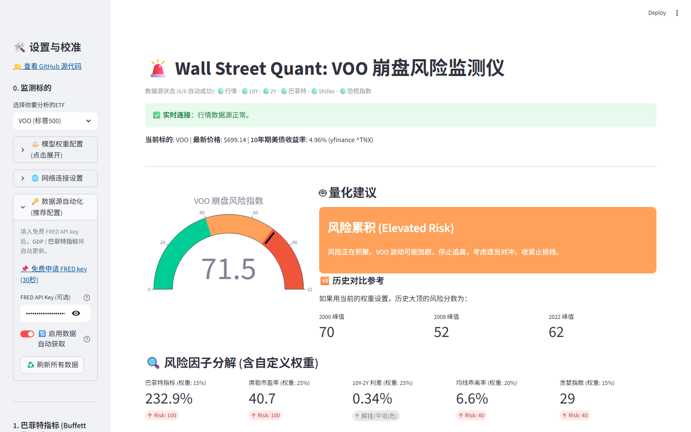

# 🚨 Wall Street Quant: US Stock Crash Monitor

> **Version v1.2 ｜ Last Updated 2026-09-16**
> A full-stack quantitative analysis tool built with Python and Streamlit. It integrates macroeconomic indicators and technical analysis to monitor crash risks for the S&P 500 (VOO) and Nasdaq 100 (QQQ) in real-time.

### [**🇨🇳 View Chinese Version / 中文文档**](https://github.com/middletoo/US_Stock_Crash_Monitor/blob/main/README.md)



---

## 📖 Introduction

In financial markets, single indicators can often be deceptive. This project aims to build a **Multi-factor Risk-Weighted Model**. By integrating Wall Street's most-watched macro valuation metrics (e.g., the Buffett Indicator, Shiller PE) with technical indicators (e.g., Moving Average Deviation, Treasury Yield Curve), it calculates a comprehensive **"Crash Risk Score."**

The tool helps investors stay rational during periods of extreme market euphoria and identify opportunities during extreme panic, avoiding the "herd mentality."

---

## 🆕 What's New in v1.2

**Core theme: full data-source automation — no more manual lookups.**

* ✨ **All indicators auto-fetched**: The 5 metrics that previously required manual lookup and entry (2Y Treasury yield, US GDP, Buffett Indicator, Shiller PE, Fear & Greed Index) are now fully automated — live data on startup.
* 📡 **New `data_fetcher.py` module**: A unified layer managing 7 external data sources, each with a complete "auto-fetch → cache → multi-level fallback" pipeline.
* 🔁 **Three-tier failover**: If any source fails, it automatically switches to a backup (e.g., Buffett Indicator: GuruFocus scraping → FRED computation → manual input), so it always produces a value.
* 🔑 **FRED official data**: Provide a free FRED API key and US GDP + Buffett Indicator come straight from the Federal Reserve's official database (authoritative and timely).
* ✏️ **Auto + Manual dual mode**: Every indicator auto-fetches (green ✅ with source label), with a "manual override" toggle beside it — automation with full flexibility.
* 📊 **Data-source status bar**: The page header shows live connectivity per source (🟢/🔴), plus a one-click "♻️ Refresh All Data" button.
* 🛡️ **API key safety**: Keys are configured locally via `.env` and protected by `.gitignore` — never committed to the repo.

---

## ✨ Core Features

* **Multi-dimensional Quantitative Model**: More than price tracking — a comprehensive scoring system combining **Macro**, **Valuation**, **Sentiment**, and **Technical** factors.
* **Dual Asset Switching**: Seamlessly switch between **VOO (S&P 500)** and **QQQ (Nasdaq 100)**, with independent analysis for assets of different volatility profiles.
* **Full Data Automation**: 7 indicators auto-fetched with no manual entry; automatic fallback on network failures, adapted for restricted network environments.
* **High Customizability**:
  * **Weight Adjustment**: Dynamically adjust each indicator's weight based on the current market environment (e.g., high-interest-rate or AI-bubble conditions).
  * **Manual Calibration**: Every indicator supports one-click switching to manual input for flexible overrides.
* **Historical Comparison**: Threshold references and cross-era risk-score comparisons for key historical crashes (2000, 2008, 2022).
* **Interactive Charts**: High-performance interactive candlestick charts and risk dashboards rendered with Plotly.

---

## 📡 Data Sources

All indicators are auto-fetched (v1.2). Sources have been verified for direct reachability:

| Indicator | Auto Source | Direct Access | Fallback | Key Required |
|-----------|-------------|:------------:|----------|:------------:|
| ETF Price / 200-day MA | yfinance (VOO/QQQ) | ✅ | Mock data | No |
| 10Y Treasury Yield | yfinance `^TNX` | ✅ | CNBC / akshare | No |
| 2Y Treasury Yield | CNBC API | ✅ | akshare | No |
| US GDP | FRED API | ✅* | Manual input | **Yes** |
| Buffett Indicator (Cap/GDP) | GuruFocus scraping | ✅ | FRED computation | No |
| Shiller PE (CAPE) | multpl.com scraping | ✅ | Manual input | No |
| Fear & Greed Index | CNN dataviz API | ✅ | Manual slider | No |

\* The FRED web domain (fred.stlouisfed.org) is blocked in some regions, but the **API domain (api.stlouisfed.org) is directly reachable**, so the official API is used.

> 💡 **About the FRED key**: the tool works fine without one — the Buffett Indicator falls back to GuruFocus scraping automatically, and only GDP (a low-frequency, quarterly figure) needs occasional manual entry. With a key, all 7 indicators are fully automated.

---

## 🛠️ Monitoring Indicator System

The model calculates risk based on 5 core factors (default weights are adjustable):

1. **Buffett Indicator**: Total US Market Cap / US GDP. Measures the overall degree of the stock market bubble.
2. **Shiller PE (CAPE)**: Inflation-adjusted cyclically adjusted price-to-earnings ratio; a valuation benchmark that spans bull and bear markets.
3. **Treasury Yield Curve (10Y-2Y Spread)**: A famous recession warning indicator, specifically monitoring the high-risk moment when the curve "uninverts" after a period of inversion.
4. **200-Day Moving Average Deviation**: Measures how much the short-term price deviates from the long-term trend to determine if an asset is severely overbought.
5. **Fear & Greed Index**: A contrarian indicator; extreme greed often signals a short-term market top.

---

## 🚀 Quick Start

### Prerequisites

* Python 3.8 or higher

### Installation Steps

**1. Clone the Repository**
```bash
git clone https://github.com/middletoo/US_Stock_Crash_Monitor.git
cd US_Stock_Crash_Monitor
```

**2. Install Dependencies**
```bash
pip install -r requirements.txt
```

**3. (Optional but recommended) Configure a FRED API key for full automation**

The Buffett Indicator and US GDP use FRED official data, which requires a free key:

* Get a free key in 30 seconds: https://fred.stlouisfed.org/docs/api/api_key.html
* Copy `.env.example` to `.env` and fill in your key:
  ```
  FRED_API_KEY=your_key_here
  ```
* **It works without a key too**: the Buffett Indicator automatically falls back to GuruFocus scraping; only GDP needs manual entry.

**4. Run the Application**
```bash
streamlit run app.py
```

**5. Access the App**

The browser will automatically open http://localhost:8501

### How to Use

1. **Out of the box**: on startup all indicators auto-fetch live data; the header shows source status (all 🟢 = fully automated).
2. **Refresh data**: data is cached for 30 minutes; click "♻️ Refresh All Data" in the sidebar to force an update.
3. **Adjust weights**: expand "⚖️ Model Weight Configuration" and drag sliders for the current environment (aim for a 100% total).
4. **Manual calibration**: tick "✏️ Manual override" on any indicator to override its auto value (e.g., a source you trust more).
5. **Network issues**: if Yahoo Finance fails, enter a proxy under "🌐 Network Settings", or leave it blank to auto-enter Demo Mode.
6. **Switch asset**: pick VOO (S&P 500) or QQQ (Nasdaq 100) at the top of the sidebar.

---

## ⚠️ Limitations

* **Data Lag**: GDP is updated quarterly, so the Buffett Indicator cannot reflect real-time intraday changes — better for long-term trends than short-term timing.
* **Linear Weighting Flaw**: the current model uses linear weighted summation, whereas real market crashes are often non-linear chain reactions triggered by "Black Swan" events.
* **Scraping Fragility**: Shiller PE / Buffett Indicator / Fear & Greed rely on third-party pages or private APIs; if a target site changes its markup, parsing may fail (fallbacks and manual overrides are built in).
* **Subjective Factors**: although the data is automated, weight settings still involve user subjectivity.

---

## 🛡️ Disclaimer

**This project is for programming education and quantitative research purposes only. It does not constitute any investment advice.**

* Financial markets involve significant risk; invest with caution.
* The "Risk Score" provided by this tool is based on historical statistical data; past performance does not guarantee future results.
* The author is not responsible for any financial losses resulting from the use of this code.

---

**If you find this project helpful, please give it a ⭐️ Star!**
